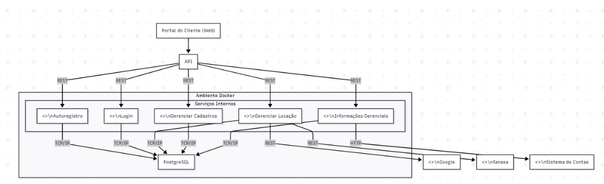

# Aluguel de Carros

[](https://openjdk.org/)
[](https://micronaut.io/)
[](https://maven.apache.org/)
[](LICENSE)

Sistema de gestão de aluguéis de automóveis, desenvolvido como projeto acadêmico para o curso de Engenharia de Software da PUC Minas.

**Equipe:** Lara Andrade, Allan Mateus, Gabriel Santiago

---

## Sobre

O sistema gerencia o ciclo completo de locação de veículos, atendendo três perfis:

| Perfil | Responsabilidades |
|---|---|
| **Cliente** | Criar, consultar, modificar e cancelar pedidos de aluguel |
| **Agente** | Avaliar pedidos, emitir pareceres financeiros e conceder contratos |
| **Administrador** | Gerenciar frota de veículos, usuários e configurações |


---

## Arquitetura

O projeto segue **MVC em camadas** com os padrões Repository, DTO, Entity e Facade, garantindo separação de responsabilidades e baixo acoplamento.

```
  Apresentação        Controllers, DTOs, Validation
       ↓
  Aplicação           Services (Facade), Mappers, Exception Handlers
       ↓
  Domínio             Entities, Exceptions
       ↓
  Infraestrutura      Repositories, Database Config
```

### Diagrama de Componentes

> Diagrama completo com fluxo de sequência disponível em [`docs/DIAGRAMA_COMPONENTES.md`](docs/DIAGRAMA_COMPONENTES.md).

---

## Stack

| Tecnologia | Versão | Papel |
|---|---|---|
| Java | 17 | Linguagem |
| Micronaut | 4.10.x | Framework (HTTP server, DI, AOP) |
| Micronaut Data JPA | 4.x | Persistência com Hibernate 6 |
| H2 | 2.x | Banco de dados em memória (dev/test) |
| PostgreSQL | 15+ | Banco de dados de produção (futuro) |
| JUnit 5 | 5.x | Testes |
| Mockito | 5.x | Mocking |
| Maven | 3.9+ | Build e dependências |

---

## Estrutura do Projeto

```
src/
├── main/java/com/pucminas/aluguelcarros/
│   ├── Application.java
│   ├── domain/
│   │   ├── entity/
│   │   │   └── Cliente.java
│   │   └── exception/
│   │       ├── BusinessException.java
│   │       └── ResourceNotFoundException.java
│   ├── application/
│   │   ├── controller/
│   │   │   └── ClienteController.java
│   │   ├── dto/
│   │   │   ├── request/ClienteRequestDTO.java
│   │   │   └── response/ClienteResponseDTO.java
│   │   ├── mapper/
│   │   │   └── ClienteMapper.java
│   │   ├── service/
│   │   │   ├── IClienteService.java
│   │   │   └── impl/ClienteServiceImpl.java
│   │   └── handler/
│   │       ├── GlobalExceptionHandler.java
│   │       └── ErrorResponse.java
│   └── infrastructure/
│       └── repository/
│           └── ClienteRepository.java
├── main/resources/
│   ├── application.yml
│   └── logback.xml
└── test/java/com/pucminas/aluguelcarros/
    ├── unit/
    │   └── ClienteServiceImplTest.java        (13 testes)
    └── integration/
        ├── ClienteControllerTest.java         (8 testes)
        └── ClienteRepositoryTest.java         (8 testes)
```

---

## Executando

### Pré-requisitos

- JDK 17+
- `JAVA_HOME` configurado (ex: `C:\Program Files\Java\jdk-17`)

> Maven **não** precisa estar instalado globalmente. O projeto inclui o Maven Wrapper (`mvnw`).

### Subir a aplicação

```bash
# Windows
set JAVA_HOME=C:\Program Files\Java\jdk-17
.\mvnw.cmd mn:run

# Linux/Mac
export JAVA_HOME=/usr/lib/jvm/java-17
./mvnw mn:run
```

A aplicação sobe em `http://localhost:8080` com banco H2 em memória.

### Executar testes

```bash
.\mvnw.cmd test
```

29 testes (13 unitários + 16 integração) rodando contra H2 in-memory.

### Gerar JAR

```bash
.\mvnw.cmd clean package -DskipTests
java -jar target/aluguel-de-carros-0.1.0.jar
```

---

## API

Base URL: `http://localhost:8080/api/v1`

### Clientes

| Verbo | Rota | Status | Descrição |
|---|---|---|---|
| `POST` | `/clientes` | `201` | Cadastra cliente |
| `GET` | `/clientes` | `200` | Lista todos |
| `GET` | `/clientes/{id}` | `200` | Busca por ID |
| `GET` | `/clientes/cpf/{cpf}` | `200` | Busca por CPF |
| `PUT` | `/clientes/{id}` | `200` | Atualiza cliente |
| `DELETE` | `/clientes/{id}` | `204` | Remove cliente |

### Exemplo de request

```json
POST /api/v1/clientes
Content-Type: application/json

{
  "rg": "MG-12.345.678",
  "cpf": "12345678901",
  "nome": "João Silva",
  "endereco": "Rua das Flores, 123 - BH/MG",
  "profissao": "Engenheiro de Software",
  "entidadesEmpregadoras": ["TechCorp", "ConsultaLtda"],
  "rendimentos": 8500.00
}
```

### Validações

- `rg`, `cpf`, `nome`, `endereco`, `profissao` e `rendimentos` são obrigatórios
- `cpf` deve ter entre 11 e 14 caracteres
- `entidadesEmpregadoras` aceita no máximo 3 itens
- `rendimentos` deve ser >= 0
- CPF e RG devem ser únicos no sistema

### Respostas de erro

```json
{
  "status": 400,
  "error": "Bad Request",
  "message": "Já existe um cliente cadastrado com o CPF: 12345678901",
  "timestamp": "2026-03-27T19:15:00"
}
```

---

## Princípios e Padrões

O projeto aplica **SOLID** na prática:

- **SRP** -- cada classe tem uma responsabilidade: Controller lida com HTTP, Service com regras de negócio, Repository com persistência, Mapper com conversão
- **OCP** -- novas entidades podem ser adicionadas sem alterar as existentes
- **LSP** -- a interface `IClienteService` permite substituir implementações sem quebrar o controller
- **ISP** -- interfaces focadas (`IClienteService` não expõe operações de outros domínios)
- **DIP** -- o controller depende da abstração `IClienteService`, não da implementação concreta

Padrões utilizados: **Repository**, **DTO**, **Facade** (service como fachada de negócio), **Mapper**.

---

## Documentação

| Documento | Caminho |
|---|---|
| Histórias de Usuário | [`HISTORIAS_USUARIO.md`](HISTORIAS_USUARIO.md) |
| Diagrama de Componentes (detalhado) | [`docs/DIAGRAMA_COMPONENTES.md`](docs/DIAGRAMA_COMPONENTES.md) |
| Diagrama de Componentes do Sistema | [`docs/diagrama_componentes_sistema.png`](docs/diagrama_componentes_sistema.png) |

### Visão Geral do Sistema



---

## Contribuição

1. Crie uma branch a partir de `develop`: `git checkout -b feature/minha-feature`
2. Implemente com testes
3. Rode `.\mvnw.cmd test` e garanta que tudo passa
4. Use commits semânticos: `feat(cliente): adiciona busca por CPF`
5. Abra um Pull Request para `develop`

| Prefixo | Uso |
|---|---|
| `feat` | Nova funcionalidade |
| `fix` | Correção de bug |
| `refactor` | Refatoração sem mudança de comportamento |
| `test` | Adição ou correção de testes |
| `docs` | Documentação |
| `chore` | Tarefas de manutenção |

---

## Licença

[MIT](LICENSE)

<p align="center">
  PUC Minas -- Engenharia de Software
</p>
