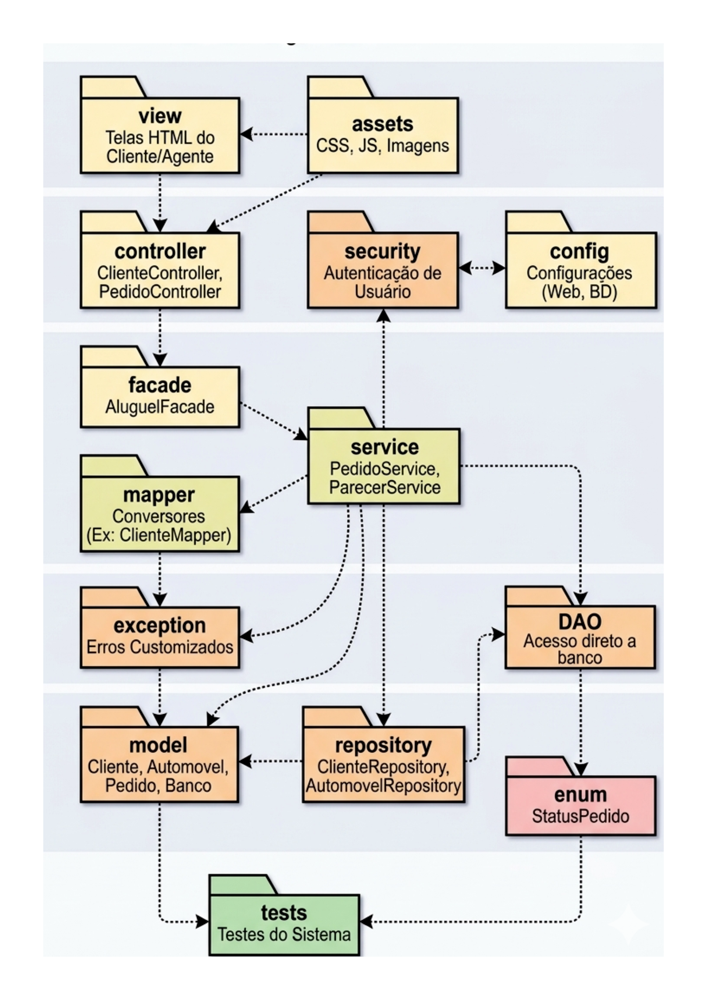

# Sistema de Gestão de Aluguel de Carros

[](https://openjdk.org/)
[](https://spring.io/projects/spring-boot)
[](LICENSE)
[](https://maven.apache.org/)

Sistema web para gestão completa do ciclo de vida de aluguéis de automóveis, desenvolvido como projeto acadêmico para o curso de Engenharia de Software da PUC Minas.

**Equipe:** Lara Andrade, Allan Mateus, Gabriel Santiago

---

## Índice

- [Sobre o Projeto](#sobre-o-projeto)
- [Arquitetura](#arquitetura)
- [Princípios SOLID](#princípios-solid)
- [Padrões de Projeto](#padrões-de-projeto)
- [Estrutura do Projeto](#estrutura-do-projeto)
- [Tecnologias](#tecnologias)
- [Configuração e Execução](#configuração-e-execução)
- [API Endpoints](#api-endpoints)
- [Documentação](#documentação)
- [Contribuição](#contribuição)

---

## Sobre o Projeto

O sistema atende três perfis principais de usuários:

| Perfil | Responsabilidades |
|--------|-------------------|
| **Cliente** | Criar, modificar, consultar e cancelar pedidos de aluguel |
| **Agente** | Avaliar pedidos financeiramente, emitir pareceres e conceder contratos |
| **Administrador** | Gerenciar usuários, frota de veículos e configurações do sistema |

---

## Arquitetura

O projeto segue uma arquitetura em camadas baseada no padrão **MVC (Model-View-Controller)**, com separação clara de responsabilidades e baixo acoplamento entre os componentes.

```
┌─────────────────────────────────────────────────────────────────┐
│                      CAMADA DE APRESENTAÇÃO                     │
│                    (Controllers + Views/DTOs)                   │
├─────────────────────────────────────────────────────────────────┤
│                      CAMADA DE APLICAÇÃO                        │
│                    (Services + Use Cases)                       │
├─────────────────────────────────────────────────────────────────┤
│                      CAMADA DE DOMÍNIO                          │
│                (Entities + Domain Services + Interfaces)        │
├─────────────────────────────────────────────────────────────────┤
│                      CAMADA DE INFRAESTRUTURA                   │
│              (Repositories + External Services + Config)        │
└─────────────────────────────────────────────────────────────────┘
```

### Descrição das Camadas

| Camada | Responsabilidade | Componentes |
|--------|------------------|-------------|
| **Apresentação** | Interface com o usuário e exposição de APIs REST | Controllers, DTOs, Validators |
| **Aplicação** | Orquestração de casos de uso e regras de aplicação | Services, Use Cases, Mappers |
| **Domínio** | Regras de negócio e entidades do sistema | Entities, Value Objects, Domain Services |
| **Infraestrutura** | Persistência, serviços externos e configurações | Repositories, Adapters, Configurations |

---

## Princípios SOLID

O projeto foi desenvolvido seguindo rigorosamente os princípios SOLID:

### S - Single Responsibility Principle (SRP)
Cada classe possui uma única responsabilidade bem definida.

```
├── ClienteController.java      → Apenas gerencia requisições HTTP de clientes
├── ClienteService.java         → Apenas regras de negócio de clientes
├── ClienteRepository.java      → Apenas persistência de clientes
└── ClienteMapper.java          → Apenas conversão entre DTOs e entidades
```

### O - Open/Closed Principle (OCP)
Classes abertas para extensão, fechadas para modificação.

```java
// Interface base para cálculo de tarifas
public interface TarifaCalculator {
    BigDecimal calcular(Aluguel aluguel);
}

// Extensões sem modificar a interface
public class TarifaDiariaCalculator implements TarifaCalculator { }
public class TarifaSemanalCalculator implements TarifaCalculator { }
public class TarifaMensalCalculator implements TarifaCalculator { }
```

### L - Liskov Substitution Principle (LSP)
Subtipos são substituíveis por seus tipos base.

```java
public abstract class Usuario { }
public class Cliente extends Usuario { }
public class Agente extends Usuario { }
public class Administrador extends Usuario { }
```

### I - Interface Segregation Principle (ISP)
Interfaces específicas e coesas, evitando contratos "gordos".

```java
public interface Autenticavel {
    void autenticar(String token);
}

public interface Auditavel {
    void registrarAuditoria(AuditoriaLog log);
}
```

### D - Dependency Inversion Principle (DIP)
Dependência de abstrações, não de implementações concretas.

```java
@Service
public class PedidoService {
    private final PedidoRepository repository;  // Interface, não implementação
    private final NotificacaoService notificacao;  // Interface, não implementação
    
    public PedidoService(PedidoRepository repository, NotificacaoService notificacao) {
        this.repository = repository;
        this.notificacao = notificacao;
    }
}
```

---

## Padrões de Projeto

### Padrões Criacionais

| Padrão | Aplicação |
|--------|-----------|
| **Factory Method** | Criação de diferentes tipos de usuários e veículos |
| **Builder** | Construção de objetos complexos (Pedido, Contrato) |
| **Singleton** | Gerenciadores de configuração e conexão |

### Padrões Estruturais

| Padrão | Aplicação |
|--------|-----------|
| **Adapter** | Integração com serviços externos (gateways de pagamento) |
| **Facade** | Simplificação de operações complexas de aluguel |
| **Repository** | Abstração da camada de persistência |

### Padrões Comportamentais

| Padrão | Aplicação |
|--------|-----------|
| **Strategy** | Diferentes estratégias de cálculo de tarifas |
| **Observer** | Notificações de mudança de status de pedidos |
| **Template Method** | Fluxo padrão de avaliação de crédito |
| **State** | Gerenciamento de estados do pedido de aluguel |

---

## Estrutura do Projeto

A estrutura segue o diagrama de pacotes definido em `/docs/diagrama_pacotes.png`:

```
src/
├── main/
│   ├── java/com/pucminas/aluguelcarros/
│   │   │
│   │   ├── view/                            # Telas HTML do Cliente/Agente
│   │   │   ├── cliente/
│   │   │   └── agente/
│   │   │
│   │   ├── assets/                          # Recursos Estáticos
│   │   │   ├── css/
│   │   │   ├── js/
│   │   │   └── imagens/
│   │   │
│   │   ├── controller/                      # Controladores REST/Web
│   │   │   ├── ClienteController.java
│   │   │   └── PedidoController.java
│   │   │
│   │   ├── security/                        # Autenticação de Usuário
│   │   │   ├── AuthService.java
│   │   │   ├── JwtFilter.java
│   │   │   └── SecurityConfig.java
│   │   │
│   │   ├── config/                          # Configurações (Web, BD)
│   │   │   ├── WebConfig.java
│   │   │   └── DatabaseConfig.java
│   │   │
│   │   ├── facade/                          # Padrão Facade
│   │   │   └── AluguelFacade.java
│   │   │
│   │   ├── service/                         # Regras de Negócio
│   │   │   ├── PedidoService.java
│   │   │   └── ParecerService.java
│   │   │
│   │   ├── mapper/                          # Conversores DTO <-> Entity
│   │   │   └── ClienteMapper.java
│   │   │
│   │   ├── exception/                       # Erros Customizados
│   │   │   ├── BusinessException.java
│   │   │   └── ResourceNotFoundException.java
│   │   │
│   │   ├── dao/                             # Data Access Objects
│   │   │   ├── ClienteDAO.java
│   │   │   └── AutomovelDAO.java
│   │   │
│   │   ├── repository/                      # Abstração de Persistência
│   │   │   ├── ClienteRepository.java
│   │   │   └── AutomovelRepository.java
│   │   │
│   │   ├── model/                           # Entidades do Domínio
│   │   │   ├── Cliente.java
│   │   │   ├── Automovel.java
│   │   │   ├── Pedido.java
│   │   │   └── Banco.java
│   │   │
│   │   └── enum/                            # Enumeradores
│   │       └── StatusPedido.java
│   │
│   └── resources/
│       ├── application.yml
│       ├── application-dev.yml
│       └── application-prod.yml
│
├── test/                                    # Testes do Sistema
│   └── java/com/pucminas/aluguelcarros/
│       ├── unit/
│       ├── integration/
│       └── e2e/
│
└── docs/                                    # Documentação
    ├── diagrama_pacotes.png
    ├── diagrama_classes.png
    ├── diagrama_casos_uso.png
    └── *.drawio
```

### Diagrama de Pacotes



### Fluxo de Dependências

```
┌─────────────────────────────────────────────────────────────────┐
│  VIEW / ASSETS          →  Interface do usuário (HTML/CSS/JS)  │
├─────────────────────────────────────────────────────────────────┤
│  CONTROLLER             →  Recebe requisições HTTP             │
│  SECURITY / CONFIG      →  Autenticação e configurações        │
├─────────────────────────────────────────────────────────────────┤
│  FACADE                 →  Simplifica operações complexas      │
│  SERVICE                →  Regras de negócio                   │
│  MAPPER                 →  Conversão de objetos                │
├─────────────────────────────────────────────────────────────────┤
│  EXCEPTION              →  Tratamento de erros                 │
│  REPOSITORY / DAO       →  Acesso a dados                      │
├─────────────────────────────────────────────────────────────────┤
│  MODEL / ENUM           →  Entidades e enumeradores            │
├─────────────────────────────────────────────────────────────────┤
│  TESTS                  →  Testes do sistema                   │
└─────────────────────────────────────────────────────────────────┘
```

---

## Tecnologias

### Backend
| Tecnologia | Versão | Propósito |
|------------|--------|-----------|
| Java | 17+ | Linguagem principal |
| Spring Boot | 3.x | Framework web |
| Spring Data JPA | 3.x | Persistência de dados |
| Spring Security | 6.x | Autenticação e autorização |
| Hibernate | 6.x | ORM |
| Maven | 3.9+ | Gerenciamento de dependências |

### Banco de Dados
| Tecnologia | Propósito |
|------------|-----------|
| PostgreSQL | Banco de dados principal |
| H2 | Banco de dados para testes |
| Flyway | Migrações de banco de dados |

### Qualidade e Testes
| Tecnologia | Propósito |
|------------|-----------|
| JUnit 5 | Framework de testes |
| Mockito | Mocking para testes unitários |
| Jacoco | Cobertura de código |
| SonarQube | Análise estática de código |

### Documentação
| Tecnologia | Propósito |
|------------|-----------|
| Swagger/OpenAPI | Documentação de API |
| JavaDoc | Documentação de código |

---

## Configuração e Execução

### Pré-requisitos

- JDK 17+
- Maven 3.9+
- PostgreSQL 15+
- Docker (opcional)

### Configuração Local

1. **Clone o repositório**
```bash
git clone https://github.com/seu-usuario/aluguel-de-carros.git
cd aluguel-de-carros
```

2. **Configure o banco de dados**
```bash
# Crie o banco de dados
createdb aluguel_carros

# Ou use Docker
docker-compose up -d postgres
```

3. **Configure as variáveis de ambiente**
```bash
cp .env.example .env
# Edite o arquivo .env com suas configurações
```

4. **Execute a aplicação**
```bash
# Desenvolvimento
mvn spring-boot:run -Dspring.profiles.active=dev

# Produção
mvn clean package -DskipTests
java -jar target/aluguel-carros-1.0.0.jar --spring.profiles.active=prod
```

### Docker

```bash
# Build da imagem
docker build -t aluguel-carros:latest .

# Execução com docker-compose
docker-compose up -d
```

---

## API Endpoints

### Clientes

| Método | Endpoint | Descrição |
|--------|----------|-----------|
| GET | `/api/v1/clientes` | Lista todos os clientes |
| GET | `/api/v1/clientes/{id}` | Busca cliente por ID |
| POST | `/api/v1/clientes` | Cadastra novo cliente |
| PUT | `/api/v1/clientes/{id}` | Atualiza cliente |
| DELETE | `/api/v1/clientes/{id}` | Remove cliente |

### Pedidos

| Método | Endpoint | Descrição |
|--------|----------|-----------|
| GET | `/api/v1/pedidos` | Lista todos os pedidos |
| GET | `/api/v1/pedidos/{id}` | Busca pedido por ID |
| POST | `/api/v1/pedidos` | Cria novo pedido |
| PATCH | `/api/v1/pedidos/{id}/status` | Atualiza status do pedido |
| DELETE | `/api/v1/pedidos/{id}` | Cancela pedido |

### Automóveis

| Método | Endpoint | Descrição |
|--------|----------|-----------|
| GET | `/api/v1/automoveis` | Lista automóveis disponíveis |
| GET | `/api/v1/automoveis/{id}` | Busca automóvel por ID |
| POST | `/api/v1/automoveis` | Cadastra novo automóvel |
| PUT | `/api/v1/automoveis/{id}` | Atualiza automóvel |
| DELETE | `/api/v1/automoveis/{id}` | Remove automóvel |

---

## Documentação

| Documento | Localização | Descrição |
|-----------|-------------|-----------|
| Histórias de Usuário | `/docs/Requisitos.md` | Requisitos detalhados |
| Diagrama de Classes | `/docs/diagrams/` | Estrutura do domínio |
| Diagrama de Casos de Uso | `/docs/diagrams/` | Interações dos atores |
| Diagrama de Pacotes | `/docs/diagrams/` | Visão lógica da arquitetura |
| OpenAPI Spec | `/docs/api/openapi.yaml` | Especificação da API |
| ADRs | `/docs/architecture/ADR/` | Decisões arquiteturais |

---

## Contribuição

### Padrões de Código

- Seguir as convenções de código Java do Google
- Manter cobertura de testes acima de 80%
- Documentar métodos públicos com JavaDoc
- Usar commits semânticos (conventional commits)

### Fluxo de Trabalho

1. Crie uma branch a partir de `develop`
```bash
git checkout -b feature/nome-da-feature
```

2. Implemente e teste suas alterações

3. Execute os testes
```bash
mvn test
```

4. Commit usando convenção semântica
```bash
git commit -m "feat(pedido): adiciona validação de data de devolução"
```

5. Abra um Pull Request para `develop`

### Tipos de Commit

| Tipo | Descrição |
|------|-----------|
| `feat` | Nova funcionalidade |
| `fix` | Correção de bug |
| `docs` | Documentação |
| `style` | Formatação de código |
| `refactor` | Refatoração |
| `test` | Testes |
| `chore` | Tarefas de manutenção |

---

## Licença

Este projeto está licenciado sob a Licença MIT - veja o arquivo [LICENSE](LICENSE) para detalhes.

---

<p align="center">
  Desenvolvido com dedicação para PUC Minas - Engenharia de Software
</p>
